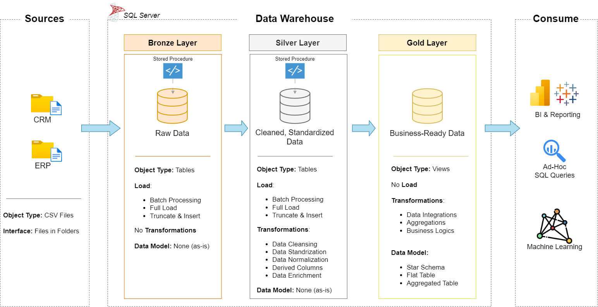

# 🧠 Data Warehouse & Analytics Engineering Project  

A complete end-to-end **data warehousing and analytics** solution built with **SQL Server**, designed to showcase modern **data engineering**, **data modeling**, and **data architecture** practices using the **Medallion Architecture** framework.  

This project integrates data from **ERP** and **CRM** systems into a unified analytical model, demonstrating real-world ETL/ELT workflows, data quality handling, and business intelligence readiness.  

---

## 🏗️ Data Architecture

The solution follows the **Medallion Architecture** pattern:  


1. **Bronze Layer — Raw Data**  
   Ingests CSV data from ERP and CRM sources into SQL Server with minimal transformation.  
2. **Silver Layer — Refined Data**  
   Cleanses, standardizes, and normalizes datasets to ensure consistency and reliability.  
3. **Gold Layer — Business Models**  
   Models data into a **Star Schema** optimized for analytics, reporting, and business insights.  

---

## 📘 Project Overview

This repository demonstrates the full lifecycle of a modern data warehouse:

- **Data Architecture:** Scalable Medallion-based data design (Bronze → Silver → Gold).  
- **ETL Pipelines:** Automated extraction, transformation, and loading processes.  
- **Data Modeling:** Dimensional modeling with well-structured **fact** and **dimension** tables.  
- **Analytics & Reporting:** SQL-based dashboards and queries delivering actionable insights.  

🎯 **Skill Areas Highlighted:**
- SQL & ETL Development  
- Data Engineering & Architecture  
- Data Modeling & Warehousing  
- Data Quality Management  
- Business Intelligence  

---

## ⚙️ Tools & Resources

All tools used in this project are **free and publicly available**:

- 📂 [Datasets](datasets/) — ERP and CRM CSV files  
- 🖥️ [SQL Server Express](https://www.microsoft.com/en-us/sql-server/sql-server-downloads) — Database engine  
- 🧩 [SSMS (SQL Server Management Studio)](https://learn.microsoft.com/en-us/sql/ssms/download-sql-server-management-studio-ssms?view=sql-server-ver16) — Query and database management  
- 🧱 [Draw.io](https://www.drawio.com/) — Data flow, schema, and architecture diagrams  
- 📘 [Notion Project Tracker](https://thankful-pangolin-2ca.notion.site/SQL-Data-Warehouse-Project-16ed041640ef80489667cfe2f380b269?pvs=4) — Documentation of all project phases and steps  

---

## 🧩 Project Requirements

### 1. Data Engineering — Building the Warehouse  

**Objective:**  
Design and implement a **SQL Server Data Warehouse** consolidating ERP and CRM data for unified analytics.  

**Specifications:**  
- **Data Sources:** Two CSV-based source systems (ERP & CRM)  
- **Integration:** Merge both systems into a single analytical model  
- **Data Quality:** Handle missing, inconsistent, and duplicate values  
- **Scope:** Latest dataset only (no historization)  
- **Documentation:** Clear explanation of the model for analysts and business users  

---

### 2. Business Intelligence — Analytics & Reporting  

**Objective:**  
Generate insights on:  
- Customer Behavior  
- Product Performance  
- Sales Trends  

All insights are delivered through **SQL-based analytics**, enabling **data-driven decision-making**.  
Detailed requirements available in [docs/requirements.md](docs/requirements.md).  

---

## 🗂️ Repository Structure
```
data-warehouse-project/
│
├── datasets/                           # Raw datasets used for the project (ERP and CRM data)
│
├── docs/                               # Project documentation and architecture details
│   ├── etl.drawio                      # Draw.io file shows all different techniquies and methods of ETL
│   ├── data_architecture.drawio        # Draw.io file shows the project's architecture
│   ├── data_catalog.md                 # Catalog of datasets, including field descriptions and metadata
│   ├── data_flow.drawio                # Draw.io file for the data flow diagram
│   ├── data_models.drawio              # Draw.io file for data models (star schema)
│   ├── naming-conventions.md           # Consistent naming guidelines for tables, columns, and files
│
├── scripts/                            # SQL scripts for ETL and transformations
│   ├── bronze/                         # Scripts for extracting and loading raw data
│   ├── silver/                         # Scripts for cleaning and transforming data
│   ├── gold/                           # Scripts for creating analytical models
│
├── tests/                              # Test scripts and quality files
│
├── README.md                           # Project overview and instructions
├── LICENSE                             # License information for the repository
├── .gitignore                          # Files and directories to be ignored by Git
└── requirements.txt                    # Dependencies and requirements for the project
```
---


---

## 🧾 License

Licensed under the [MIT License](LICENSE).  
Free to use, modify, and distribute with proper attribution.

---

## 🌟 Key Takeaways

This project simulates a **production-grade data warehouse** demonstrating:  
- Modern data architecture with layered modeling.  
- Maintainable, modular SQL ETL pipelines.  
- Analytical models supporting real business questions.  

Perfect for recruiters, hiring managers, or anyone evaluating **hands-on data engineering** proficiency.


